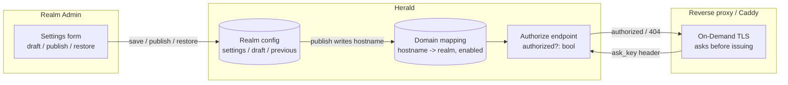

A Realm Admin can register a branded login domain (like `login.acme.com`) for their Realm, get CNAME guidance, and watch the CNAME/TLS status go live. The domain is globally unique and follows a draft/publish/restore lifecycle. Herald only authorizes the reverse proxy to issue TLS certificates for domains a Realm Admin has registered — unregistered domains are refused, which is the certificate-abuse gate.

This is a "bring your own domain" setup with no separate DNS-TXT ownership step. CNAME'ing the domain to the Herald-owned hostname proves DNS control, and the ACME challenge the reverse proxy runs proves the DNS actually points at Herald — together they are the ownership verification. There is no wildcard support (`*.acme.com`) and no Herald-owned `*.herald.com` subdomain.

## What shipped and what didn't

Two things are easy to conflate, so they are stated up front:

- **Shipped**: per-Realm custom-domain *configuration* (register a domain, see CNAME guidance, see live CNAME/TLS status) with a draft/publish/restore lifecycle, plus the certificate *authorization* gate that lets the reverse proxy issue TLS only for registered domains.
- **Not shipped (planned)**: serving the actual auth flow *on* the custom domain. A request to `login.acme.com` does not yet resolve to the Realm's auth pages without a path prefix. Realm routing is still driven by the `{realmId}` path segment, exactly as before. Email links, OAuth callbacks, and passkey credentials are therefore not yet custom-domain-aware.

The planned piece depends on a host→realm request-resolution mechanism that was reverted (the web framework applies its routing match before a rewrite layer can patch the path). The configuration and authorization gate that *did* ship are the foundation for it.

## Who this is for

Realm Admins who want to point their own branded domain at Herald's hosted login, and operators who run the reverse proxy (Caddy) in front of Herald and need to wire up on-demand TLS. End users (Regular Users) never see the configuration surface.

Developers: this is not an API reference — for endpoints and schemas, see the OpenAPI reference. The custom-domain management endpoints live under `/api/realms/{realmId}/config/custom-domain`.

## What problem it solves

End users hesitate to type a password into a page whose URL is not their tenant's brand. Herald's default path-based URL (`herald.com/{realmId}/auth/login`) carries the right Realm, but the domain is still `herald.com`. White-label already brands the *page* (logo, colors, copy); a custom domain is meant to brand the *URL* itself — a separate trust signal.

Before that payoff lands, the plumbing has to exist: the tenant has to be able to register the domain, prove they control it, and get a TLS certificate issued — and Herald has to refuse to issue certificates for domains nobody registered, so the infrastructure can't be abused as a certificate mill for phishing. That plumbing is what shipped.

## How it works

### Registering a domain

The Realm Admin opens *Settings → Custom Domain*, types an exact hostname (e.g. `login.acme.com`), and saves a draft. The form shows the CNAME target — the Herald-owned hostname they must point their domain at — and a status panel that reflects whether the CNAME is correct and whether TLS is ready.

The hostname is normalized server-side: lowercased, trailing dot stripped, and any value carrying a scheme, port, path, or wildcard is rejected. This stops `login.acme.com.` or uppercase variants from bypassing the global-unique constraint.

The domain is globally unique across Realms — both drafts and published configs hold the slot, so two Realms can't draft the same hostname and then collide on publish.

### Draft, publish, restore

The lifecycle mirrors white-label exactly:

1. **Save draft.** Writes the in-progress hostname to a draft slot. The currently live config is untouched.
2. **Publish.** Promotes the draft to the live config and writes the hostname into the domain-registration mapping. The previously live config is copied to a previous slot for one-step undo. The draft is cleared.
3. **Discard draft.** Throws away the draft and resets the form to the live config.
4. **Restore previous.** Swaps the previous slot back into the live config and rolls the mapping back accordingly. Gated behind a confirm dialog.

Only the published config counts as "registered" for the authorization gate.

### The certificate-abuse gate

When the reverse proxy (Caddy) is asked to issue a TLS certificate for a hostname via on-demand TLS, it first asks Herald: "is this hostname registered and live?" Herald answers with a single boolean — `authorized: true` or `404`. No Realm identity or other detail is leaked.

- A published, enabled hostname → `authorized: true` → the proxy proceeds with the ACME challenge.
- An unregistered hostname → `404` → the proxy declines to issue. A phishing domain pointed at Herald gets no certificate.
- The authorization gate checks only "published and enabled." CNAME-verified and TLS-ready are *display* fields for the admin panel, not part of the authorization decision — otherwise authorization and issuance would form a circular dependency (`tls_ready=false` → refuse to issue → `tls_ready` never becomes `true`).

The shared secret between Herald and the proxy is `[custom_domain].ask_key` in the config; the proxy passes it in the `X-Herald-Ask-Key` header. See [Configuration](/docs/configuration#custom-domain).

## Data flow

The admin mutates config through the management endpoints. Publishing a domain writes its hostname into the registration mapping. The reverse proxy consults the authorize endpoint before issuing any certificate; only mapped, enabled hostnames are authorized.

## Configuration

The feature needs two global settings in the config file, under `[custom_domain]`:

| Field | Purpose |
|-------|---------|
| `ask_key` | Shared secret for the authorize endpoint (`X-Herald-Ask-Key`). **Must be non-empty or the server will not boot.** |
| `cname_target` | The Herald-owned hostname shown to Realm Admins as the CNAME destination. |

See [Configuration → custom-domain](/docs/configuration#custom-domain) for the full table and a sample. If you are not using custom domains, set `ask_key` to any non-empty placeholder to satisfy the boot guard.

## What is intentionally out of scope

- Serving the auth flow on the custom domain (host→realm resolution). Planned, not shipped.
- Per-domain email links, OAuth callbacks, device-flow URIs. Planned, depends on host→realm.
- Per-domain passkey RP derivation. Planned, depends on host→realm; until then passkey RP stays single-domain.
- Cross-domain session sharing between the custom domain and the canonical domain.
- Wildcard / multi-level domains (`*.acme.com`). Exact hostnames only.
- Herald-owned `*.herald.com` subdomains.
- A separate DNS-TXT ownership-verification UI step. CNAME + ACME is the verification.
- A TLS operations dashboard (issuance / renewal status panel).
- Email sending domain customization (SPF / DKIM / DMARC) — that is realm-email-config, a separate concern.

## Related docs

- [Custom-domain PRD](https://github.com/timzaak/cas-2/blob/main/docs/prd/core/realm-custom-domain.md) — product scope, business rules, acceptance goals
- [Custom-domain user stories](https://github.com/timzaak/cas-2/blob/main/docs/user-stories/core/realm-custom-domain.md) — US-CD-001 / US-CD-003 / US-CD-005 acceptance scenarios
- [White-label](/docs/ui-custom) — brands the page; custom domain brands the URL. The lifecycle is the same shape.
- [Configuration](/docs/configuration#custom-domain) — the `[custom_domain]` config section
- [Deployment](/docs/deployment) — reverse-proxy / on-demand TLS setup
