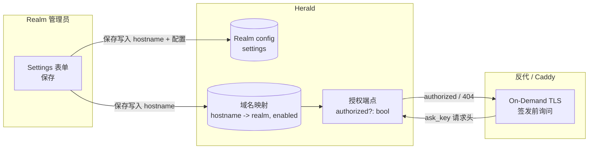

Realm 管理员可以为本 Realm 注册一个品牌登录域名（如 `login.acme.com`），获取 CNAME 指引，并查看 CNAME/TLS 生效状态。域名全局唯一，保存即生效——没有单独的发布步骤。Herald 只授权反代层为已由 Realm 管理员注册的域名签发 TLS 证书——未注册域名会被拒绝，这就是证书滥用防护门控。

这是「自带域名」的简化方案，没有单独的 DNS TXT 所有权验证步骤。把域名 CNAME 到 Herald 指定的 hostname 就证明了 DNS 控制权，加上反代层跑的 ACME 挑战证明 DNS 实际指向 Herald——两者组合就是所有权验证。不支持通配域名（`*.acme.com`），也没有 Herald 自有的 `*.herald.com` 子域。

## 交付了什么、没交付什么

这两件事容易混，先说清楚：

- **已交付**：per-Realm 自定义域名*配置*（注册域名、看 CNAME 指引、看 CNAME/TLS 生效状态），单次保存即生效；加上证书*授权*门控，让反代层只为已注册的域名签发 TLS。
- **未交付（计划中）**：在自定义域名上承载实际的 auth 流。访问 `login.acme.com` 目前还不能在没有路径前缀的情况下解析到该 Realm 的 auth 页面。Realm 路由仍然由 `{realmId}` 路径段决定，和以前完全一样。因此邮件链接、OAuth 回调、passkey 凭证目前都不是按自定义域名生成的。

计划中的部分依赖一个 host→realm 请求解析机制，它曾被回退（web 框架在改写层能补改路径之前就已经完成了路由匹配）。已交付的配置和授权门控正是它的基础。

## 给谁看

想让自家品牌域名指向 Herald 托管登录页的 Realm 管理员，以及在 Herald 前面跑反代（Caddy）、需要接 on-demand TLS 的运维人员。终端用户（Regular User）永远看不到配置入口。

开发者：这不是 API 参考，端点和 schema 见 OpenAPI 参考。自定义域名的管理端点在 `/api/realms/{realmId}/config/custom-domain` 下。

## 解决什么问题

终端用户在 URL 不是自己租户品牌的页面上输入密码时会犹豫。Herald 默认的基于路径的 URL（`herald.com/{realmId}/auth/login`）虽然带上了正确的 Realm，但域名仍然是 `herald.com`。White-label 已经品牌化了*页面*（logo、配色、文案）；自定义域名是要品牌化 *URL* 本身——一个独立的信任信号。

在这个收益落地之前，基础设施得先存在：租户得能注册域名、证明自己拥有它、拿到 TLS 证书；而 Herald 得拒绝为没人注册的域名签发证书，这样这套基础设施就不能被滥用成钓鱼用的证书印钞机。交付的就是这套基础设施。

## 工作原理

### 注册域名

Realm 管理员打开 *Settings → Custom Domain*，输入一个精确 hostname（如 `login.acme.com`），保存。表单会展示 CNAME 目标——他们需要把域名指向的 Herald 指定 hostname——以及一个状态面板，反映 CNAME 是否正确、TLS 是否就绪。

hostname 在服务端做规范化：小写化、去尾点，任何带协议、端口、路径或通配符的值都会被拒绝。这样 `login.acme.com.` 或大小写变体就没法绕过全局唯一约束。

域名跨 Realm 全局唯一——两个 Realm 不会注册同一个 hostname。

### 保存（单步，立即生效）

与 white-label（使用草稿/发布/恢复生命周期）不同，自定义域名是单次保存、立即生效。没有草稿、没有发布、没有恢复：

- **保存。** 校验 hostname、检查全局唯一性、写入域名注册映射、持久化配置——一步完成。域名在保存成功的那一刻就生效了。
- **切换域名。** 保存不同的 hostname 会覆盖前一个；映射更新为新 hostname，旧的被移除。
- **清空域名。** 保存空 hostname 会移除该 Realm 的所有映射行——该 Realm 不再有任何自定义域名。

这比 white-label 更简单，因为自定义域名是低频、低风险的配置：填错字不会破坏任何东西（hostname 必须通过 CNAME/TLS 验证才真正提供流量），切回去只需重新输入正确的 hostname 再保存。

保存后的配置才算作授权门控的「已注册」。

### 证书滥用门控

当反代（Caddy）被要求通过 on-demand TLS 为某个 hostname 签发 TLS 证书时，它会先问 Herald：「这个 hostname 是否已注册并生效？」Herald 只回答一个布尔值——`authorized: true` 或 `404`。不泄露 Realm 身份或其他细节。

- 已配置且启用的 hostname → `authorized: true` → 反代继续跑 ACME 挑战。
- 未注册的 hostname → `404` → 反代拒绝签发。指向 Herald 的钓鱼域名拿不到证书。
- 授权门控只看「已配置且启用」。CNAME 是否已验证、TLS 是否就绪是给管理面板看的*展示*字段，不参与授权判定——否则授权和签发会形成循环依赖（`tls_ready=false` → 拒绝签发 → `tls_ready` 永远不会变 `true`）。

Herald 与反代之间的共享密钥是配置里的 `[custom_domain].ask_key`；反代在 `X-Herald-Ask-Key` 请求头里带上它。见 [配置](/docs/zh/configuration#custom_domain)。

## 数据流转

管理员通过管理端端点保存 hostname，同时写入配置行和域名注册映射。反代在签发任何证书前先查授权端点；只有已映射、已启用的 hostname 才被授权。

## 配置

该功能需要在配置文件的 `[custom_domain]` 段下设置两个全局项：

| 字段 | 用途 |
|------|------|
| `ask_key` | 授权端点的共享密钥（`X-Herald-Ask-Key`）。**必须非空，否则服务端拒绝启动。** |
| `cname_target` | 展示给 Realm 管理员的 CNAME 目标 hostname。 |

完整字段表和示例见 [配置 → custom-domain](/docs/zh/configuration#custom_domain)。如果不用自定义域名功能，把 `ask_key` 设为任意非空占位字符串即可满足启动守卫。

## 有意不做的范围

- 在自定义域名上承载 auth 流（host→realm 解析）。计划中，尚未交付。
- 按域名生成的邮件链接、OAuth 回调、device 流 URI。计划中，依赖 host→realm。
- 按域名派生 passkey RP。计划中，依赖 host→realm；在此之前 passkey RP 保持单一域名。
- 自定义域名与 canonical 域之间的跨域会话共享。
- 通配 / 多级域名（`*.acme.com`）。仅精确 hostname。
- Herald 自有的 `*.herald.com` 子域。
- 单独的 DNS TXT 所有权验证 UI 步骤。CNAME + ACME 即所有权验证。
- TLS 运维仪表盘（签发 / 续期状态面板）。
- 邮件发信域定制（SPF / DKIM / DMARC）——那是 realm-email-config，另一个关注点。

## 相关文档

- [自定义域名 PRD](https://github.com/timzaak/cas-2/blob/main/docs/prd/core/realm-custom-domain.md) — 产品范围、业务规则、验收目标
- [自定义域名用户故事](https://github.com/timzaak/cas-2/blob/main/docs/user-stories/core/realm-custom-domain.md) — US-CD-001 / US-CD-003 / US-CD-005 验收场景
- [White-label](/docs/zh/ui-custom) — 品牌化页面；自定义域名品牌化 URL。White-label 使用草稿/发布生命周期；自定义域名单次保存即生效（更简单，因为它是低频配置，且有 CNAME/TLS 验证兜底）。
- [配置](/docs/zh/configuration#custom_domain) — `[custom_domain]` 配置段
- [部署](/docs/zh/deployment) — 反代 / on-demand TLS 设置
