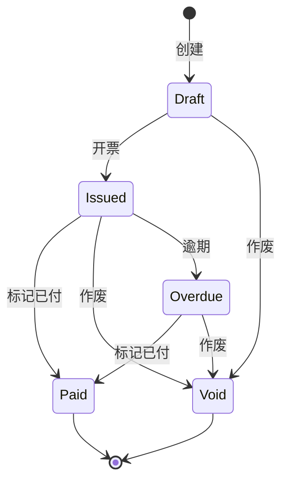

# 发票管理

Herald 支持两种发票：管理员手动创建的发票，以及用户自助申请的发票。两种发票走同一个底层数据模型，但入口和操作权限不同。

支付方（Stripe、Creem 等）产生的发票属于外部发票，Herald 只保存一个引用和跳转链接，不做编辑。

## 给谁看

负责管理 Herald 发票的 Realm Admin，以及需要理解发票用户侧流程的前端开发者。

## 发票状态

发票有五个状态，流转方向是单向的（Void 是终态）：

每个状态可执行的操作：

| 状态 | 可执行操作 |
|------|-----------|
| Draft | 查看、编辑、开票（Issue）、作废 |
| Issued | 查看、作废、标记已付、下载 PDF |
| Overdue | 查看、作废、标记已付、下载 PDF |
| Paid | 查看、下载 PDF |
| Void | 查看 |

外部发票（provider 不是 manual）只有查看权限，不支持编辑和状态变更。

## 管理员操作

### 配置开票方信息

发票 PDF 上会显示开票方信息。首次使用前需要配置。

1. 在左侧菜单找到 **Invoices**，点击进入
2. 点击 **Seller Config**（或齿轮图标）
3. 填写开票方信息：
   - 公司名称
   - 地址
   - 税号
   - 联系方式
   - 其他需要印在发票上的信息
4. 保存

### 创建发票

1. 在 Invoices 页面点击 **Create Invoice**
2. 填写发票表单：
   - **买方信息**：名称、地址、联系方式
   - **行项目**（至少一行）：描述、数量、单价（单位：元，系统自动转为分存储）
   - **折扣**：固定金额或百分比
   - **税费**：固定金额或百分比
   - **运费**：固定金额
   - **付款条件**：如 "Net 30"、"Due on Receipt"
   - **到期日**：可选
   - **备注**：可选
3. 系统自动计算小计、折扣、税额、运费和总计
4. 点击创建，发票进入 **Draft** 状态

### 开票（Issue）

Draft 状态的发票确认无误后，点击 **Issue** 开票。发票状态变为 **Issued**，系统生成发票编号。

开票后发票内容不可修改。如果发现错误，只能作废后重新创建。

### 作废（Void）

Draft 或 Issued 状态的发票可以作废。作废是不可逆操作。

### 标记已付（Mark as Paid）

Issued 或 Overdue 状态的发票可以手动标记为已付。这个操作用于线下收款或支付方没有自动回调的场景。

### 下载 PDF

Issued、Paid、Overdue 状态的发票支持下载 PDF。PDF 由 Herald 服务端生成，包含开票方信息、买方信息、行项目明细和总计。

## 用户侧操作

### 查看发票列表

用户登录后，在个人中心的发票页面可以看到自己的发票列表。包括管理员创建的发票和自己申请的发票。

### 申请发票

用户可以对已完成的支付申请发票：

1. 在发票页面点击 **Apply for Invoice**
2. 填写发票抬头信息（名称、税号、地址等）
3. 提交后生成 Draft 状态的发票，管理员可以在后台看到并处理

用户申请的发票 source 标记为 `user_application`，管理员创建的标记为 `admin_manual`。

### 下载 PDF

用户可以下载自己发票的 PDF，前提是发票处于可下载的状态（Issued、Paid、Overdue）。

## 外部发票

支付方（Stripe、Creem、Shopify、WeChat）产生的发票属于外部发票。Herald 只保存基本信息和一个跳转链接（`externalHostedUrl`），不在本地生成 PDF。

外部发票在列表中会显示支付方标签（如 "Stripe"），点击查看时跳转到支付方自己的发票页面。

## 发票策略配置

管理员可以配置发票策略（Invoice Policy），控制发票的自动生成行为。比如支付成功后是否自动创建发票、默认的付款条件等。

配置入口在 Invoices 页面的 **Policy Config** 中。

## API 概览

管理员发票接口：

| 方法 | 路径 | 说明 |
|------|------|------|
| GET | `/api/bill/{realmId}/invoices` | 发票列表 |
| POST | `/api/bill/{realmId}/invoices` | 创建发票 |
| GET | `/api/bill/{realmId}/invoices/{invoiceId}` | 发票详情 |
| PATCH | `/api/bill/{realmId}/invoices/{invoiceId}` | 更新发票（仅 Draft） |
| POST | `/api/bill/{realmId}/invoices/{invoiceId}/issue` | 开票 |
| POST | `/api/bill/{realmId}/invoices/{invoiceId}/void` | 作废 |
| POST | `/api/bill/{realmId}/invoices/{invoiceId}/mark-paid` | 标记已付 |
| GET | `/api/bill/{realmId}/invoices/{invoiceId}/pdf` | 下载 PDF |
| GET/PUT | `/api/bill/{realmId}/invoice-seller-config` | 开票方配置 |

用户发票接口：

| 方法 | 路径 | 说明 |
|------|------|------|
| GET | `/api/bill/{realmId}/my/invoices` | 我的发票列表 |
| POST | `/api/bill/{realmId}/my/invoices` | 申请发票 |
| GET | `/api/bill/{realmId}/my/invoices/{invoiceId}` | 发票详情 |
| GET | `/api/bill/{realmId}/my/invoices/{invoiceId}/pdf` | 下载 PDF |
