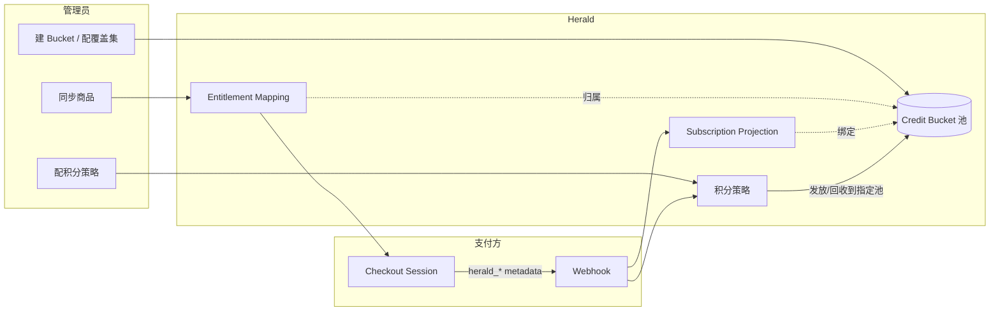

# Herald 计费架构

Herald 的计费系统不维护本地商品目录。Stripe、Creem 这些支付方管理 Product、Price、Checkout 和订阅生命周期；Herald 只保留做授权和积分发放所需的最小数据。

## 给谁看

需要理解 Herald 计费模块设计的开发者。不涉及具体支付方的对接操作，对接指南见各支付方的单独文档。

## 旧模型和新模型

旧模型有三层本地目录：Product → SubscriptionPlan → Subscription。管理员在 Herald 后台创建产品和套餐，配置支付映射，再分配给 Client App。问题是 Stripe/Creem 自己也有 Product/Price/Subscription，两边的目录要手动保持同步，时间一长就漂移。

新模型把商业目录交给支付方，Herald 不再提供 Product 和 SubscriptionPlan 的 CRUD。取而代之的是一个映射表（Entitlement Mapping），记录"支付方的哪个商品对应 Herald 的哪个 entitlement"。

积分侧也改了。旧的积分账本是"一个用户一个总账"，所有积分混在一起。新模型用 Credit Bucket 把积分拆成多个互相隔离的池，按应用群结算和消费。Bucket 是下面几个概念共同的归属点：映射挂在 Bucket 上，订阅绑定 Bucket，积分发到 Bucket 的池里。

## 核心概念

### Credit Bucket

Credit Bucket 是积分池的隔离单元。一个 Realm 可以建多个 Bucket，每个 Bucket 是一个独立的积分池，余额互不影响。

它解决的问题是：一个 Realm 下可能同时跑多条业务线，比如一个 AI 对话应用和一个图片生成应用，它们的积分要分开结算、分开消费，不能串。每个 Bucket 覆盖一组 Client App，只有被覆盖的 Client App 才能消费这个池的积分。

每个 Bucket 的字段：

| 字段 | 说明 |
|------|------|
| `bucket_key` | 标识，匹配 `^[a-z0-9-]{1,64}$`，Realm 内唯一 |
| `name` | 展示名 |
| `display_order` | 展示顺序 |
| `enabled` | 是否启用。禁用后对新用户不可见、不可购；已持有该池的用户仍能消费剩余积分 |
| `receives_registration_credits` | 是否是本 Realm 的注册积分接收池 |

注册积分接收池：每个 Realm 至多一个 Bucket 标为 `receives_registration_credits`，数据库用部分唯一索引 `uq_credit_buckets_registration_pool` 保证唯一。用户注册时发放的积分、免费的周期性积分，都进这个池。如果 Realm 没配接收池，这些系统发放的积分无处可去，直接不发放——不会偷偷落到某个隐式默认池。Herald 没有"默认 Bucket"这个概念，每一个积分池都必须是管理员显式建出来的。

Bucket 目录的管理 API 在 `/api/realms/{realmId}/billing/credit-buckets` 下，包含列表、详情、创建、更新、删除，外加一个 `overview` 接口返回每个 Bucket × 每种积分类型的余额矩阵和跨 Bucket 合计。全部需要 Realm Admin 的 `points.manage` 权限。

几个会直接报错而不是静默处理的约束：

- 覆盖集不能为空。创建和更新都校验，空集返回 400。
- 从一个 Bucket 移除已挂载的映射会被拒绝，返回 `bucket_orphan_mapping`。要移动映射，先把它挂到目标 Bucket。
- 删除 Bucket 时，如果还有活跃订阅、或有余额的钱包，返回 409 `bucket_in_use`。
- 改覆盖集只影响未来的路由，不回收已经发出去的余额。

池里的积分按来源分五种类型，余额页和后台概览都按这五类分别统计。Bucket 概览矩阵和用户余额都沿这五个 key 展开：

| key | 含义 |
|------|------|
| `topup` | 充值积分（用户主动购买） |
| `subscription` | 会员积分（订阅套餐赠送） |
| `registration` | 注册积分（注册时一次性赠送） |
| `free_periodic` | 免费周期积分（按周期自动发放） |
| `granted` | 主动发放积分（管理员或 SDK 发放） |

### Entitlement Mapping

Entitlement Mapping 是一张映射表，把支付方的外部商品 ID 映射到 Herald 内部的 `entitlement_key`，同时归属到一个 Credit Bucket。它不是商品目录，是 allowlist 加同步缓存。

每条映射包含：

| 字段 | 说明 |
|------|------|
| `payment_provider` | 支付方名称（stripe、creem） |
| `external_product_id` | 支付方侧的商品 ID（如 `prod_xxxx`） |
| `external_price_id` | 支付方侧的价格 ID（Stripe 有，Creem 不适用） |
| `entitlement_key` | Herald 内部的权益标识（如 `pro-plan`） |
| `bucket_id` | 归属的 Credit Bucket。购买该商品后积分进入这个 Bucket 的池 |
| `billing_type` | 计费类型：Recurring 或 OneTime |
| `points_per_period` | 每个周期发放的积分数 |
| `grant_on_subscribe` | 首次订阅是否发放积分 |
| `validity_days` | 积分有效期（天） |
| `enabled` | 是否启用。禁用后 webhook 仍更新订阅投影，但不触发积分发放 |

映射通过两种方式产生：

1. **管理员手动同步**：调用支付方 Product API，拉取所有商品，自动创建或更新映射。新建的映射先绑定到本 Realm 的注册接收池，之后管理员可以把它挪到别的 Bucket。
2. **Webhook 增量更新**：支付事件触发时从 webhook payload 提取信息更新缓存。

同步失败时本地缓存继续服务，不会静默降级。

### Subscription Projection

Subscription 是支付方订阅状态的本地只读副本，不是 Herald 拥有的订阅。SDK 和授权查询读取这个投影，不依赖实时支付方 API。

投影字段包括 `realm_id`、`user_id`、`entitlement_key`、`bucket_id`、`status`、`current_period_start/end`、`provider_metadata` 等。订阅在建立时就绑定到购买时那个 Entitlement Mapping 所属的 Bucket，之后续费、升降级、取消、退款的积分发放和回收都回到同一个池，不会串到别的 Bucket。旧的 `plan_id`、`tier`、`billing_period` 字段已移除，需要这些信息时从 `entitlement_key` 或 `provider_metadata` 派生。

订阅状态：Active、Trialing、PastDue、Canceled、Expired、Paused、Disputed、ScheduledCancel、Incomplete。

`has_access()` 方法判断用户是否有权限：Active 和 Trialing 状态返回 true，其他返回 false。

### Metadata 契约

所有 Herald 使用的 metadata key 统一用 `herald_` 前缀。这些 metadata 写入 Checkout Session 或 Subscription，支付方在 webhook 中原样返回。

必填 metadata：

| Key | 说明 |
|-----|------|
| `herald_realm_id` | Realm ID |
| `herald_client_app_id` | Client App ID |
| `herald_user_id` | 用户 ID |
| `herald_entitlement_key` | 权益标识 |
| `herald_billing_kind` | `subscription` 或 `points_package` |

Checkout 创建时验证这些 metadata，缺失则拒绝创建。Webhook 收到事件后按以下顺序解析 entitlement_key：

1. Webhook metadata 中的 `herald_entitlement_key`
2. 本地映射表（按 provider + external_product_id 查询）
3. 都找不到则记录错误，不静默跳过

### 积分策略

积分策略的 source of truth 是 Herald 本地的 Entitlement Mapping，不是支付方的 metadata。Stripe Product/Price metadata 可以作为导入来源，但 Creem 无 metadata 功能，必须在 Herald 中配置。

策略按 `entitlement_key` 查询，覆盖：首次订阅发放、续费发放、取消回收、退款回收、升降级处理。发放和回收都定位到订阅绑定的 Bucket 池，按上面五种 credit_type 分别入账。

管理员可以在 Herald 中修改积分策略。修改的是 Herald 的业务规则，不会回写到支付方。

## 数据流向

用户支付流程：

1. 前端调用 Checkout API，传入 `entitlement_key` 和 `payment_provider`
2. Herald 查 Entitlement Mapping，找到对应的外部商品和它归属的 Bucket
3. Herald 调用支付方 API 创建 Checkout Session，metadata 写入 `herald_*` 字段
4. 用户在支付方页面完成付款
5. 支付方发 Webhook 给 Herald
6. Herald 从 metadata 解析 entitlement_key，创建/更新 Subscription Projection，绑定到映射的 Bucket
7. Herald 按 entitlement_key 查积分策略，把积分发到该 Bucket 的池，或从该池回收

## SDK 消费怎么路由

第三方应用通过 SDK 消费积分时只传 Client App 和金额，不感知 Bucket。Herald 找到所有覆盖这个 Client App 的 Bucket 池，按过期时间从近到远跨池扣减，原子完成、不超额。如果没有任何覆盖的池、或覆盖的池合计余额不足，消费被拒绝并返回明确的余额不足提示。Bucket 没覆盖这个 Client App 时，它的池不会被扣减。

## 支持的支付方

| 支付方 | 商业目录 | 订阅 | 一次性购买（积分包） | Metadata 支持 |
|--------|---------|------|---------------------|--------------|
| Stripe | Product / Price API | Checkout Session + Subscription | Payment Intent | Product/Price/Checkout/Subscription 均支持 |
| Creem | Product API | Checkout | Checkout | Checkout metadata，webhook 返回 |

Stripe、Creem 是发起式平台，通过 PaymentAttempt 统一管理支付过程。

## 已移除的功能

以下功能在 2026 年 6 月的重构中移除，不再存在：

- 本地 Product CRUD（管理页面和 API）
- 本地 SubscriptionPlan CRUD（管理页面和 API）
- Plan → Payment Provider Mapping 配置
- Plan → Client App 分配
- 关联表：`subscription_plan_payment_provider`、`client_app_subscription_plan`、`points_plan_configs`
- "未归属映射 → 不可购"的中间态：`bucket_id` 在映射、订阅、支付尝试上都是 NOT NULL，一个商品要么属于某个 Bucket，要么不可购，没有悬空状态

如果你在代码或文档中看到 "plan_id"、"Product 管理"、"Subscription Plan" 相关的描述，它们已经过时。

## 相关文档

- [Credit Bucket 用户故事](../user-stories/billing/credit-bucket.md) — Bucket 目录、覆盖集、购买入池、跨池消费、订阅生命周期的验收场景
- [Stripe 对接指南](billing-stripe-payment.md) — Stripe 支付方配置和 Webhook 处理
- [Creem 对接指南](billing-creem-payment.md) — Creem 支付方配置和 Webhook 处理
- [发票管理](billing-invoice.md) — 发票创建、开票、PDF 生成
