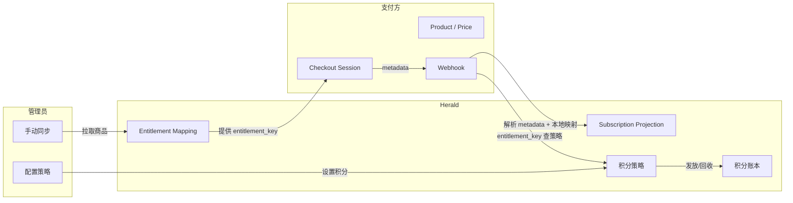

# Herald 计费架构

Herald 的计费系统不维护本地商品目录。Stripe、Creem 这些支付方管理 Product、Price、Checkout 和订阅生命周期；Herald 只保留做授权和积分发放所需的最小数据。

## 给谁看

需要理解 Herald 计费模块设计的开发者。不涉及具体支付方的对接操作，对接指南见各支付方的单独文档。

## 旧模型和新模型

旧模型有三层本地目录：Product → SubscriptionPlan → Subscription。管理员在 Herald 后台创建产品和套餐，配置支付映射，再分配给 Client App。问题是 Stripe/Creem 自己也有 Product/Price/Subscription，两边的目录要手动保持同步，时间一长就漂移。

新模型把商业目录交给支付方，Herald 不再提供 Product 和 SubscriptionPlan 的 CRUD。取而代之的是一个映射表（Entitlement Mapping），记录"支付方的哪个商品对应 Herald 的哪个 entitlement"。

## 四个核心概念

### Entitlement Mapping

Entitlement Mapping 是一张映射表，把支付方的外部商品 ID 映射到 Herald 内部的 `entitlement_key`。它不是商品目录，是 allowlist 加同步缓存。

每条映射包含：

| 字段 | 说明 |
|------|------|
| `payment_provider` | 支付方名称（stripe、creem、wechat） |
| `external_product_id` | 支付方侧的商品 ID（如 `prod_xxxx`） |
| `external_price_id` | 支付方侧的价格 ID（Stripe 有，Creem 不适用） |
| `entitlement_key` | Herald 内部的权益标识（如 `pro-plan`） |
| `billing_type` | 计费类型：Recurring 或 OneTime |
| `points_per_period` | 每个周期发放的积分数 |
| `grant_on_subscribe` | 首次订阅是否发放积分 |
| `validity_days` | 积分有效期（天） |
| `enabled` | 是否启用。禁用后 webhook 仍更新订阅投影，但不触发积分发放 |

映射通过两种方式产生：

1. **管理员手动同步**：调用支付方 Product API，拉取所有商品，自动创建或更新映射
2. **Webhook 增量更新**：支付事件触发时从 webhook payload 提取信息更新缓存

同步失败时本地缓存继续服务，不会静默降级。

### Subscription Projection

Subscription 是支付方订阅状态的本地只读副本，不是 Herald 拥有的订阅。SDK 和授权查询读取这个投影，不依赖实时支付方 API。

投影字段包括 `realm_id`、`user_id`、`entitlement_key`、`status`、`current_period_start/end`、`provider_metadata` 等。旧的 `plan_id`、`tier`、`billing_period` 字段已移除，需要这些信息时从 `entitlement_key` 或 `provider_metadata` 派生。

订阅状态：Active、Trialing、PastDue、Canceled、Expired、Paused、Disputed、ScheduledCancel、Incomplete。

`has_access()` 方法判断用户是否有权限：Active 和 Trialing 状态返回 true，其他返回 false。

### Metadata 契约

所有 Herald 使用的 metadata key 统一用 `herald_` 前缀。这些 metadata 写入 Checkout Session 或 Subscription，支付方在 webhook 中原样返回。

必填 metadata：

| Key | 说明 |
|-----|------|
| `herald_realm_id` | Realm ID |
| `herald_client_app_id` | Client App ID |
| `herald_user_id` | 用户 ID |
| `herald_entitlement_key` | 权益标识 |
| `herald_billing_kind` | `subscription` 或 `points_package` |

Checkout 创建时验证这些 metadata，缺失则拒绝创建。Webhook 收到事件后按以下顺序解析 entitlement_key：

1. Webhook metadata 中的 `herald_entitlement_key`
2. 本地映射表（按 provider + external_product_id 查询）
3. 都找不到则记录错误，不静默跳过

### 积分策略

积分策略的 source of truth 是 Herald 本地的 Entitlement Mapping，不是支付方的 metadata。Stripe Product/Price metadata 可以作为导入来源，但 Creem 无 metadata 功能，必须在 Herald 中配置。

策略按 `entitlement_key` 查询，覆盖：首次订阅发放、续费发放、取消回收、退款回收、升降级处理。

管理员可以在 Herald 中修改积分策略。修改的是 Herald 的业务规则，不会回写到支付方。

## 数据流向

用户支付流程：

1. 前端调用 Checkout API，传入 `entitlement_key` 和 `payment_provider`
2. Herald 查 Entitlement Mapping，找到对应的外部商品
3. Herald 调用支付方 API 创建 Checkout Session，metadata 写入 `herald_*` 字段
4. 用户在支付方页面完成付款
5. 支付方发 Webhook 给 Herald
6. Herald 从 metadata 解析 entitlement_key，创建/更新 Subscription Projection
7. Herald 按 entitlement_key 查积分策略，发放或回收积分

## 支持的支付方

| 支付方 | 商业目录 | 订阅 | 一次性购买（积分包） | Metadata 支持 |
|--------|---------|------|---------------------|--------------|
| Stripe | Product / Price API | Checkout Session + Subscription | Payment Intent | Product/Price/Checkout/Subscription 均支持 |
| Creem | Product API | Checkout | Checkout | Checkout metadata，webhook 返回 |
| WeChat Pay | 无商品概念 | Native Pay 二维码 | Native Pay 二维码 | 自定义参数 |

Stripe、Creem、WeChat 是发起式平台，通过 PaymentAttempt 统一管理支付过程。

## 已移除的功能

以下功能在 2026 年 6 月的重构中移除，不再存在：

- 本地 Product CRUD（管理页面和 API）
- 本地 SubscriptionPlan CRUD（管理页面和 API）
- Plan → Payment Provider Mapping 配置
- Plan → Client App 分配
- 关联表：`subscription_plan_payment_provider`、`client_app_subscription_plan`、`points_plan_configs`

如果你在代码或文档中看到 "plan_id"、"Product 管理"、"Subscription Plan" 相关的描述，它们已经过时。

## 相关文档

- [Stripe 对接指南](billing-stripe-payment.md) — Stripe 支付方配置和 Webhook 处理
- [Creem 对接指南](billing-creem-payment.md) — Creem 支付方配置和 Webhook 处理
- [发票管理](billing-invoice.md) — 发票创建、开票、PDF 生成
