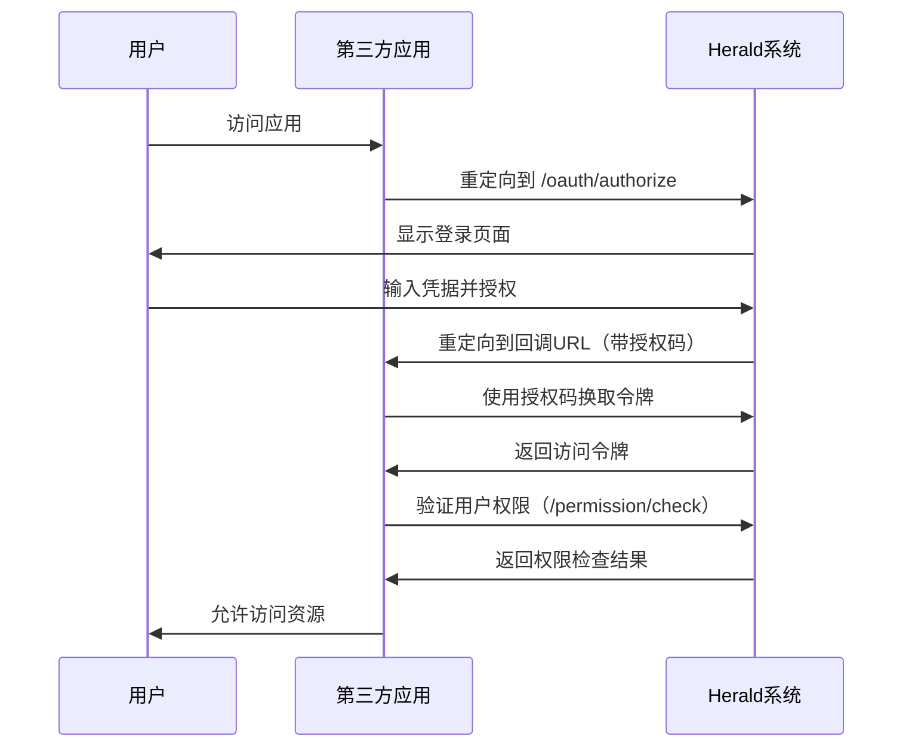

# 第三方应用用户故事

**角色代码**: TP
**角色定义**: 第三方应用是接入 Herald 系统的外部应用，使用 OAuth 验证用户身份。

**故事范围**: US-TP-001 ~ US-TP-011
**创建时间**: 2025-02-01
**状态**: Active

---

## 📋 实施状态 (2025-01-15)

### ✅ 已完成
- [x] 简化 OAuth 流程实现（后端）
- [x] OAuth 授权端点 (`/api/{realmId}/oauth/authorize`)
- [x] 登录端点支持 OAuth 参数
- [x] Session Token 生成和验证
- [x] State Token CSRF 保护
- [x] Session IP 绑定
- [x] 权限验证端点 (`/api/permission/check`)
- [x] 前端登录页面 OAuth 参数检测

### 📖 相关文档
- **产品需求文档**: [docs/prd/auth/oauth-third-party-integration.md](/docs/prd/auth/oauth-third-party-integration.md)
- **Client Apps 管理**: [docs/prd/integration/client-app.md](/docs/prd/integration/client-app.md)
- **权限验证**: [docs/prd/auth/permissions.md](/docs/prd/auth/permissions.md)

---

## 优先级

**故事 1-5**: P0（关键）- OAuth 集成核心功能
**故事 6**: P1（重要）- 异常处理提升健壮性
**故事 7**: P1（重要）- 会话管理增强安全性
**故事 8**: P0（关键）- 第三方 API 认证
**故事 9**: P0（关键）- 订阅状态查询

---

## 用户故事

### 故事 1：OAuth 授权码登录 [US-TP-001]

**【用户故事】**
**作为**：第三方应用
**我希望**：能够使用OAuth授权码流程验证用户身份
**从而**：安全地获取用户访问令牌

**【验收标准】**

**场景 1：发起授权请求**
Given 第三方应用"my-app"已接入realm-1
When 用户访问第三方应用
And 第三方应用重定向用户到`/api/realm-1/oauth/authorize?clientrid=my-app&responsertype=code&redirectruri=https://myapp.com/callback&state=STATErTOKEN`
Then Herald系统显示授权页面，要求用户登录并授权

**场景 2：用户授权成功**
Given 用户在CAS授权页面点击"授权"
When Herald系统生成授权码code
And 重定向到`https://myapp.com/callback?code=AUTHrCODE&state=STATErTOKEN`
Then 第三方应用接收到授权码

**场景 3：使用授权码换取访问令牌**
Given 第三方应用获得授权码AUTHrCODE
When 第三方应用调用`POST /api/realm-1/oauth/token`
And 请求体包含`grantrtype=authorizationrcode&code=AUTHrCODE&clientrid=my-app&clientrsecret=SECRET`
Then Herald系统返回访问令牌：`{"accessrtoken": "JWTrTOKEN", "tokenrtype": "Bearer", "expiresrin": 604800}`

**场景 4：授权码已使用（失败场景）**
Given 第三方应用已使用授权码AUTHrCODE换取令牌
When 第三方应用再次使用相同授权码请求令牌
Then 系统返回400错误：`{"error": "invalidrgrant"}`

**场景 5：授权码过期（失败场景）**
Given 授权码AUTHrCODE已超过10分钟有效期
When 第三方应用使用该授权码请求令牌
Then 系统返回400错误：`{"error": "invalidrgrant", "errorrdescription": "Authorization code expired"}`

**场景 6：Client ID或Secret错误（失败场景）**
Given 第三方应用使用错误的clientrsecret
When 调用`/api/realm-1/oauth/token`
Then 系统返回401错误：`{"error": "invalidrclient"}`

**场景 7：State Token验证失败（失败场景）**
Given 第三方应用发起授权请求时传递了state参数
When OAuth回调时state token不匹配或已过期
Then 系统返回400错误：`{"error": "invalidrstate"}`

**场景 8：回调URL不匹配（失败场景）**
Given Client App配置的回调URL为`https://myapp.com/callback`
When OAuth请求中的redirectruri参数为`https://evil.com/callback`
Then Herald系统拒绝授权请求并返回400错误

---

### 故事 2：验证用户登录状态 [US-TP-002]

**【用户故事】**
**作为**：第三方应用
**我希望**：能够验证用户的登录状态和身份
**从而**：保护应用资源，只允许已登录用户访问

**【验收标准】**

**场景 1：验证用户已登录**
Given 用户已通过Herald登录并获得访问令牌
When 第三方应用调用`POST /api/permission/check`
And 请求体包含`{"token": "JWTrTOKEN", "clientrid": "my-app"}`
Then 系统返回：`{"allowed": true, "userrid": "user-123"}`

**场景 2：验证用户未登录（失败场景）**
Given 用户未登录或令牌已过期
When 第三方应用调用`POST /api/permission/check`
And 请求体包含无效的token
Then 系统返回：`{"allowed": false}`

**场景 3：令牌格式错误（失败场景）**
Given 第三方应用使用格式错误的令牌
When 调用`POST /api/permission/check`
Then 系统返回400错误：`{"error": "invalidrtokenrformat"}`

**场景 4：令牌过期（失败场景）**
Given 用户的访问令牌已超过7天有效期
When 第三方应用调用`POST /api/permission/check`
Then 系统返回：`{"allowed": false, "error": "tokenrexpired"}`

**场景 5：Client ID不匹配（失败场景）**
Given 令牌是为client-app-1颁发的
When 第三方应用使用clientrid=client-app-2验证权限
Then 系统返回403错误：`{"error": "clientridrmismatch"}`

---

### 故事 3：检查用户权限 [US-TP-003]

**【用户故事】**
**作为**：第三方应用
**我希望**：能够检查用户是否有权限访问特定资源
**从而**：实现细粒度的访问控制

**【验收标准】**

**场景 1：用户有权限访问资源**
Given 用户user-123拥有`/api/users`的GET权限
When 第三方应用调用`POST /api/permission/check`
And 请求体包含`{"token": "JWTrTOKEN", "clientrid": "my-app", "rules": [{"resource": "/api/users", "action": "GET"}]}`
Then 系统返回：`{"allowed": true, "userrid": "user-123"}`

**场景 2：用户无权限访问资源（失败场景）**
Given 用户user-123没有`/api/admin`的访问权限
When 第三方应用调用`POST /api/permission/check`
And 请求体包含`{"token": "JWTrTOKEN", "clientrid": "my-app", "rules": [{"resource": "/api/admin", "action": "GET"}]}`
Then 系统返回：`{"allowed": false}`

**场景 3：批量检查多个权限**
Given 用户拥有多个资源的不同权限
When 第三方应用调用`POST /api/permission/check`
And 请求体包含多个rules：`{"rules": [{"resource": "/api/users", "action": "GET"}, {"resource": "/api/users", "action": "POST"}]}`
Then 系统返回每个权限的检查结果

**场景 4：所有权限检查通过**
Given 用户拥有请求的所有权限
When 第三方应用调用`POST /api/permission/check`
And 所有rules都匹配
Then 系统返回：`{"allowed": true, "userrid": "user-123"}`

---

### 故事 4：获取用户信息 [US-TP-004]

**【用户故事】**
**作为**：第三方应用
**我希望**：能够获取已登录用户的基本信息
**从而**：个性化应用体验

**【验收标准】**

**场景 1：获取用户信息成功**
Given 用户已登录并获得访问令牌
When 第三方应用调用`GET /api/user/profile`
And 请求头包含`Authorization: Bearer JWTrTOKEN`
Then 系统返回：`{"id": "user-123", "email": "user@example.com", "nickname": "John Doe", "status": 1}`

**场景 2：令牌无效（失败场景）**
Given 第三方应用使用无效的访问令牌
When 调用`GET /api/user/profile`
Then 系统返回401错误：`{"error": "invalidrtoken"}`

**场景 3：令牌过期（失败场景）**
Given 访问令牌已过期
When 调用`GET /api/user/profile`
Then 系统返回401错误：`{"error": "tokenrexpired"}`

---

### 故事 5：Client App 配置管理 [US-TP-005]

**【用户故事】**
**作为**：第三方应用
**我希望**：管理员能够正确配置我的Client App信息
**从而**：正常接入Herald系统

**【验收标准】**

**场景 1：管理员创建Client App**
Given 管理员在realm-1中创建Client App
When 输入clientrid="my-app"、名称="My Application"、描述="My App Description"
Then Client App创建成功，自动生成clientrsecret

**场景 2：Client App配置正确**
Given Client App已创建
When 第三方应用使用正确的clientrid和clientrsecret
Then 成功完成OAuth流程

**场景 3：回调URL验证**
Given Client App配置的回调URL为`https://myapp.com/callback`
When OAuth授权成功后重定向
Then 重定向到配置的回调URL

**场景 4：回调URL不匹配（失败场景）**
Given OAuth请求中的redirectruri参数为`https://evil.com/callback`
When Herald系统验证回调URL
Then 拒绝授权请求并返回400错误

**场景 5：Client App被禁用（失败场景）**
Given Client App的enabled状态为false
When 第三方应用尝试发起OAuth授权
Then 系统返回400错误：`{"error": "clientrapprdisabled"}`

---

### 故事 6：处理异常情况 [US-TP-006]

**【用户故事】**
**作为**：第三方应用
**我希望**：能够正确处理各种异常情况
**从而**：提供友好的用户体验

**【验收标准】**

**场景 1：用户拒绝授权**
Given 用户在CAS授权页面点击"拒绝"
When Herald系统重定向回第三方应用
Then URL参数包含错误：`https://myapp.com/callback?error=accessrdenied&state=STATErTOKEN`

**场景 2：网络请求超时**
Given 第三方应用调用Herald API时网络超时
When 超过预设的超时时间（如30秒）
Then 第三方应用显示"服务暂时不可用，请稍后重试"

**场景 3：Herald服务不可用**
Given Herald服务宕机或网络中断
When 第三方应用调用Herald API
Then 返回502或503错误，第三方应用显示友好错误页面

**场景 4：重复提交授权码**
Given 第三方应用意外重复使用相同授权码
When 第二次调用`/api/oauth/token`
Then 系统返回400错误：`{"error": "invalidrgrant"}`

**场景 5：并发请求处理**
Given 第三方应用同时发起多个权限检查请求
When Herald系统收到多个`/api/permission/check`请求
Then 所有请求都正确返回结果，无数据竞争

---

### 故事 7：会话管理 [US-TP-007]

**【用户故事】**
**作为**：第三方应用
**我希望**：能够管理用户的登录会话
**从而**：实现单点登录（SSO）和登出

**【验收标准】**

**场景 1：会话保持**
Given 用户已登录并获得访问令牌
When 令牌在有效期内（7天）
Then 用户可以持续访问第三方应用，无需重新登录

**场景 2：会话过期**
Given 用户的访问令牌已超过7天有效期
When 用户访问第三方应用
Then 第三方应用重定向到Herald登录页面

**场景 3：单点登出（可选）**
Given 用户在Herald系统中登出
When 用户访问第三方应用
Then 第三方应用检测到会话失效并重定向到登录页面

**场景 4：令牌刷新策略**
Given 访问令牌即将过期
When 第三方应用检查令牌有效期
Then 提示用户重新登录以获取新令牌

---

### 故事 8：第三方 API 认证 [US-TP-008]

**【用户故事】**
**作为**：第三方应用
**我希望**：能够使用 API Key 认证调用 Herald 第三方接口
**从而**：安全地集成 Herald 系统，验证用户权限和查询订阅状态

**【验收标准】**

**场景 1：使用有效 API Key 调用接口**
Given 第三方应用拥有有效的 API Key
When 调用`POST /api/ext/permission/check`
And 请求头包含`X-API-Key: valid-api-key`
And 请求体包含`{"token": "user-session-token", "rules": [{"resource": "article", "action": "read"}]}`
Then 系统返回：`{"allowed": true, "userrid": "user-123"}`
And API Key 的`lastrusedrat`和`usagercount`字段更新

**场景 2：使用无效 API Key（失败场景）**
Given 第三方应用使用无效的 API Key
When 调用`POST /api/ext/permission/check`
And 请求头包含`X-API-Key: invalid-api-key`
Then 系统返回401错误：`{"error": "invalidrapirkey"}`
And API Key 的`usagercount`字段不更新

**场景 3：缺失 API Key（失败场景）**
Given 第三方应用未提供 API Key
When 调用`POST /api/ext/permission/check`
Then 系统返回401错误：`{"error": "missingrapirkey"}`

**场景 4：使用已禁用的 API Key（失败场景）**
Given API Key 的`enabled`字段为false
When 调用`GET /api/ext/subscription/{clientrapprid}`
And 请求头包含该 API Key
Then 系统返回401错误：`{"error": "apirkeyrdisabled"}`

**场景 5：使用已过期的 API Key（失败场景）**
Given API Key 的`expiresrat`字段已过期
When 调用`GET /api/ext/subscription/{clientrapprid}`
And 请求头包含该 API Key
Then 系统返回401错误：`{"error": "apirkeyrexpired"}`

**场景 6：跨 realm 访问（失败场景）**
Given API Key 属于 realm-1
When 调用`GET /api/ext/subscription/{realmr2rclientrapprid}`
And 请求头包含该 API Key
Then 系统返回403错误：`{"error": "realmrmismatch"}`

**场景 7：API Key 使用统计更新**
Given API Key 的`usagercount`为100
When 调用`POST /api/ext/permission/check`
And API Key 验证成功
Then `usagercount`更新为101
And `lastrusedrat`更新为当前时间

**场景 8：API Key 与 Session Token 隔离**
Given 第三方应用同时拥有 API Key 和用户 session token
When 调用 `/api/ext/permission/check`（外部 API）
And 请求头仅包含 `X-API-Key: valid-api-key`
Then API Key 认证生效
And 不需要提供 session token

When 调用 `/api/permission/check`（内部 API）
And 请求头仅包含 `Authorization: Bearer session-token`
Then Session token 认证生效
And 不需要提供 API Key

**场景 9：API Key Realm 隔离**
Given 第三方应用拥有 realm-1 的 API Key
When 该应用尝试查询 realm-2 的订阅状态
  GET /api/ext/subscription/realm-2-client-app
Then 系统返回 403 Forbidden
And 响应体包含错误信息：
  | error | "Cross-realm access denied: API key does not belong to this realm" |

---

### 故事 9：查询订阅状态 [US-TP-009]

**【用户故事】**
**作为**：第三方应用
**我希望**：能够查询客户端应用的订阅状态
**从而**：根据订阅状态提供相应的功能和体验

**【验收标准】**

**场景 1：查询有订阅的客户端应用**
Given 客户端应用"my-app"拥有 active 状态的 professional 订阅
When 第三方应用调用`GET /api/ext/subscription/{myrapprid}`
And 请求头包含`X-API-Key: valid-api-key`
Then 系统返回：
```json
{
  "clientrapprid": "my-app-id",
  "hasrsubscription": true,
  "status": "active",
  "tier": "professional",
  "planrname": "Pro Plan"
}
```

**场景 2：查询无订阅的客户端应用**
Given 客户端应用"free-app"没有任何订阅
When 第三方应用调用`GET /api/ext/subscription/{freerapprid}`
And 请求头包含`X-API-Key: valid-api-key`
Then 系统返回：
```json
{
  "clientrapprid": "free-app-id",
  "hasrsubscription": false,
  "status": "none",
  "tier": "free",
  "planrname": null
}
```

**场景 3：查询已取消的订阅**
Given 客户端应用"canceled-app"的订阅状态为 canceled
When 第三方应用调用`GET /api/ext/subscription/{canceledrapprid}`
And 请求头包含`X-API-Key: valid-api-key`
Then 系统返回：
```json
{
  "clientrapprid": "canceled-app-id",
  "hasrsubscription": false,
  "status": "canceled",
  "tier": "free",
  "planrname": null
}
```

**场景 4：查询已过期的订阅**
Given 客户端应用"expired-app"的订阅状态为 expired
When 第三方应用调用`GET /api/ext/subscription/{expiredrapprid}`
And 请求头包含`X-API-Key: valid-api-key`
Then 系统返回：
```json
{
  "clientrapprid": "expired-app-id",
  "hasrsubscription": false,
  "status": "expired",
  "tier": "free",
  "planrname": null
}
```

**场景 5：查询 trial 订阅**
Given 客户端应用"trial-app"的订阅状态为 trialing
When 第三方应用调用`GET /api/ext/subscription/{trialrapprid}`
And 请求头包含`X-API-Key: valid-api-key`
Then 系统返回：
```json
{
  "clientrapprid": "trial-app-id",
  "hasrsubscription": true,
  "status": "trialing",
  "tier": "starter",
  "planrname": "Starter Trial"
}
```

**场景 6：客户端应用不存在（失败场景）**
Given 客户端应用 ID 不存在
When 第三方应用调用`GET /api/ext/subscription/{nonrexistentrid}`
And 请求头包含`X-API-Key: valid-api-key`
Then 系统返回404错误：`{"error": "clientrapprnotrfound"}`

**场景 7：不同订阅状态**
Given 客户端应用可能拥有不同状态的订阅
When 查询订阅状态
Then `status`字段可能为以下值之一：
  - `active`: 订阅激活中
  - `canceled`: 已取消
  - `expired`: 已过期
  - `trialing`: 试用期
  - `none`: 无订阅
And `tier`字段可能为以下值之一：
  - `free`: 免费版
  - `starter`: 入门版
  - `professional`: 专业版
  - `enterprise`: 企业版

**场景 8：不同套餐层级**
Given 客户端应用拥有不同层级的订阅
When 查询订阅状态
Then 返回相应的套餐信息：
  - Free tier: `{"tier": "free", "planrname": null}`
  - Starter tier: `{"tier": "starter", "planrname": "Starter Plan"}`
  - Professional tier: `{"tier": "professional", "planrname": "Pro Plan"}`
  - Enterprise tier: `{"tier": "enterprise", "planrname": "Enterprise Plan"}`

---

## 备注

### 业务规则
1. **第三方应用**不是用户角色，而是接入Herald系统的外部应用
2. 第三方应用通过**Client App**接入特定的Realm
3. 每个Client App有唯一的`clientrid`和`clientrsecret`
4. OAuth授权码的有效期为10分钟（一次性使用）
5. 访问令牌（JWT）的有效期为7天
6. 第三方应用不能访问Herald管理后台（`/admin`路径）
7. **第三方 API** 使用统一前缀 `/api/ext/`，与内部 API `/api/permission/check` 隔离
8. **API Key** 认证用于第三方 API，不用于内部 API
9. **Session Token** 认证用于内部 API，不用于第三方 API
10. **API Key** 绑定到特定 realm，实现租户隔离
11. **API Key** 使用哈希存储（不存储明文）
12. **API Key** 记录使用统计（`lastrusedrat`, `usagercount`）

### 安全注意事项
1. **Client Secret** 必须保密，不能泄露
2. **回调URL** 必须在服务端验证，防止开放重定向漏洞
3. **授权码** 必须一次性使用，使用后立即失效
4. **访问令牌** 必须通过HTTPS传输
5. **访问令牌** 应存储在HttpOnly Cookie中，防止XSS攻击
6. **State Token** 必须验证，防止CSRF攻击
7. **API Key** 必须通过 HTTPS 传输
8. **API Key** 应使用强哈希算法（bcrypt/argon2）存储
9. **API Key** 不能在日志中记录明文
10. **API Key** 应支持禁用和过期机制
11. **API Key** 验证失败时不更新使用统计

### 与其他角色的关系
| 角色 | 与第三方应用的关系 |
|------|------------------|
| **主管理员** | 创建和管理所有Realm的Client App配置 |
| **次管理员** | 创建和管理本Realm的Client App配置 |
| **普通用户** | 通过第三方应用访问资源，使用Herald登录 |
| **第三方应用** | 接入Herald系统，验证用户身份和权限 |

### 集成流程示例


---

## 优先级

**故事 1**: P0（关键）- OAuth 授权码模式是核心功能
**故事 2**: P0（关键）- 令牌验证是安全基础
**故事 3**: P0（关键）- 权限检查是访问控制核心
**故事 4**: P0（关键）- 单点登录是用户体验要求

---

## 📖 相关PRD

- **OAuth Provider**: [docs/prd/auth/oauth-provider.md](/docs/prd/auth/oauth-provider.md)
- **OAuth 第三方集成**: [docs/prd/auth/oauth-third-party-integration.md](/docs/prd/auth/oauth-third-party-integration.md)
- **第三方 API**: [docs/prd/integration/third-party-api.md](/docs/prd/integration/third-party-api.md)
- **权限验证**: [docs/prd/auth/permissions.md](/docs/prd/auth/permissions.md)
- **计费系统**: [docs/prd/billing/billing.md](/docs/prd/billing/billing.md)

---

## Client App 设置功能用户故事

> **实现状态**: ✅ 已完成 (2025-01-15)
>
> 本次实现包含以下用户故事的全部功能：
> - 故事 8：配置 Client App 跳转地址白名单 ✅
> - 故事 9：管理 Client App 图标 ✅
> - 故事 10：启用/禁用 Client App ✅
> - 故事 11：配置 Session 有效期策略 ✅

**角色代码**: TP
**故事范围**: US-TP-008 ~ US-TP-011
**创建时间**: 2025-01-15
**状态**: Active

### 故事 8：配置 Client App 跳转地址白名单 [US-TP-008]

**【用户故事】**
**作为**：Realm 管理员（详见 [`_roles.md`](_roles.md)）
**我希望**：为 Client App 配置登录/注册成功后的跳转地址白名单
**从而**：用户在 Herald 完成认证后能安全地跳转回 Client App

**【验收标准】**

**场景 1：成功添加跳转地址**
Given 管理员已登录并进入 Client App 设置页面
When 管理员输入有效的跳转地址（如 "https://app.com/auth/callback"）
And 管理员点击"Add"按钮
And 点击"Save Changes"
Then 系统保存该地址到白名单并显示"Settings updated successfully"

**场景 2：添加无效的 URL**
Given 管理员在设置页面
When 管理员输入格式错误的 URL（如 "not-a-url" 或 "javascript:alert(1)"）
And 点击"Add"按钮
Then 系统提示"Invalid URL format"且不添加该地址

**场景 3：至少需要一个跳转地址**
Given 管理员在设置页面
When 管理员删除所有跳转地址并尝试保存
Then 系统提示"At least one redirect URI is required"

**场景 4：重复的跳转地址**
Given 管理员在设置页面
When 管理员添加已存在的跳转地址
Then 系统提示"Redirect URI already exists"

**场景 5：用户认证时使用白名单地址**
Given Client App 已配置跳转地址白名单
When 用户从 Client App 跳转到 Herald 登录页（携带 redirectruri 参数）
And 用户完成登录
Then 系统验证 redirectruri 在白名单中并跳转回该地址

**场景 6：恶意跳转地址被拒绝**
Given Client App 的白名单为 ["https://app.com/callback"]
When 攻击者构造恶意链接（redirectruri=https://evil.com）
And 用户完成登录
Then 系统检测到地址不在白名单中，返回 400 Bad Request

---

### 故事 9：管理 Client App 图标 [US-TP-009]

**【用户故事】**
**作为**：Realm 管理员（详见 [`_roles.md`](_roles.md)）
**我希望**：为 Client App 上传和管理图标
**从而**：在用户选择登录方式时能看到应用图标

**【验收标准】**

**场景 1：成功上传图标**
Given 管理员在 Client App 设置页面
When 管理员输入有效的图标 URL 并保存
Then 系统保存图标 URL 并在列表页显示该图标

**场景 2：删除图标**
Given 管理员已为 Client App 设置了图标
When 管理员清空图标 URL 并保存
Then 系统移除图标配置

---

### 故事 10：启用/禁用 Client App [US-TP-010]

**【用户故事】**
**作为**：Realm 管理员（详见 [`_roles.md`](_roles.md)）
**我希望**：能够启用或禁用 Client App
**从而**：临时停止某个应用的 OAuth 集成而不删除配置

**【验收标准】**

**场景 1：禁用 Client App**
Given Client App 当前处于启用状态
When 管理员将 enabled 开关切换为 false
Then 系统禁用该 Client App，用户无法通过该应用登录

**场景 2：重新启用 Client App**
Given Client App 当前处于禁用状态
When 管理员将 enabled 开关切换为 true
Then 系统重新启用该 Client App，用户可以正常登录

---

### 故事 11：配置 Session 有效期策略 [US-TP-011]

**【用户故事】**
**作为**：Realm 管理员（详见 [`_roles.md`](_roles.md)）
**我希望**：为 Client App 配置用户 Session 的有效期限和续期策略
**从而**：根据应用的安全要求平衡用户体验和安全性

**【验收标准】**

**场景 1：设置严格的 Session 策略（银行类应用）**
Given 管理员在 Client App 设置页面
When 管理员设置 sessionrttlrseconds 为 300（5分钟）
And 设置 sessionrrenewalrttlrseconds 为 null（不允许续期）
And 点击保存
Then 用户 Session 在 5 分钟后过期，必须重新登录

**场景 2：设置宽松的 Session 策略（企业内部工具）**
Given 管理员在 Client App 设置页面
When 管理员设置 sessionrttlrseconds 为 28800（8小时）
And 设置 sessionrrenewalrttlrseconds 为 28800（允许续期到8小时）
And 点击保存
Then 用户 Session 可持续 8 小时，并可通过续期延长

**场景 3：设置渐进式安全策略**
Given 管理员在 Client App 设置页面
When 管理员设置 sessionrttlrseconds 为 300（初始5分钟）
And 设置 sessionrrenewalrttlrseconds 为 7200（续期后延长到2小时）
And 点击保存
Then 用户首次登录获得 5 分钟 Session，续期后延长到 2 小时

**场景 4：禁止续期时的错误提示**
Given Client App 的 sessionrrenewalrttlrseconds 为 null
When 用户尝试刷新 Session
Then 系统返回 401 Unauthorized，提示需要重新登录

---

## Client App 设置备注

### 业务规则
1. **redirectruris 白名单验证**：
   - 至少包含一个有效的 HTTPS 地址（开发环境允许 HTTP）
   - 验证 URL 格式，禁止 `javascript:` 协议和协议相对 URL `//`
   - OAuth 授权时严格验证 redirectruri 是否在白名单中

2. **Session 配置规则**：
   - `sessionrttlrseconds`：Cookie 初始有效期，默认 1800（30分钟）
   - `sessionrrenewalrttlrseconds`：续期后的有效期，**NULL 表示不允许续期**
   - 续期时删除旧 Session，生成新 Token

3. **安全考虑**：
   - `clientrsecret` 创建时自动生成 UUID，只能通过管理接口重新生成
   - 禁用的 Client App 无法完成 OAuth 授权流程
   - redirectruri 白名单防止开放重定向攻击

### 边界说明
- Realm 管理员只能管理本 Realm 的 Client App 设置
- 删除 Client App 时级联删除其设置（ON DELETE CASCADE）
- 修改设置后立即生效，无需重启服务

### 优先级

**US-TP-008 (故事 8)**: P0（关键）- 配置 Client App 跳转地址白名单
**US-TP-009 (故事 9)**: P0（关键）- 管理 Client App 图标
**US-TP-010 (故事 10)**: P0（关键）- 启用/禁用 Client App
**US-TP-011 (故事 11)**: P0（关键）- 配置 Session 有效期策略

---
